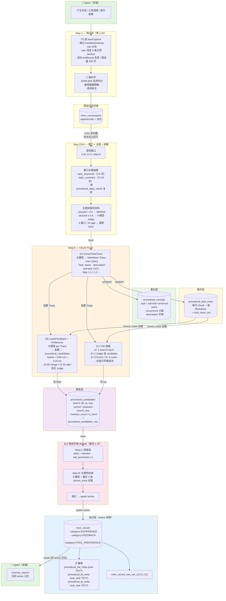
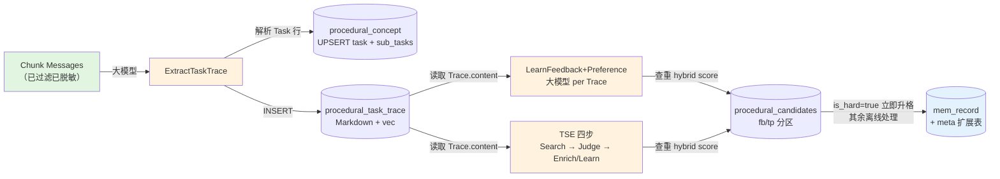
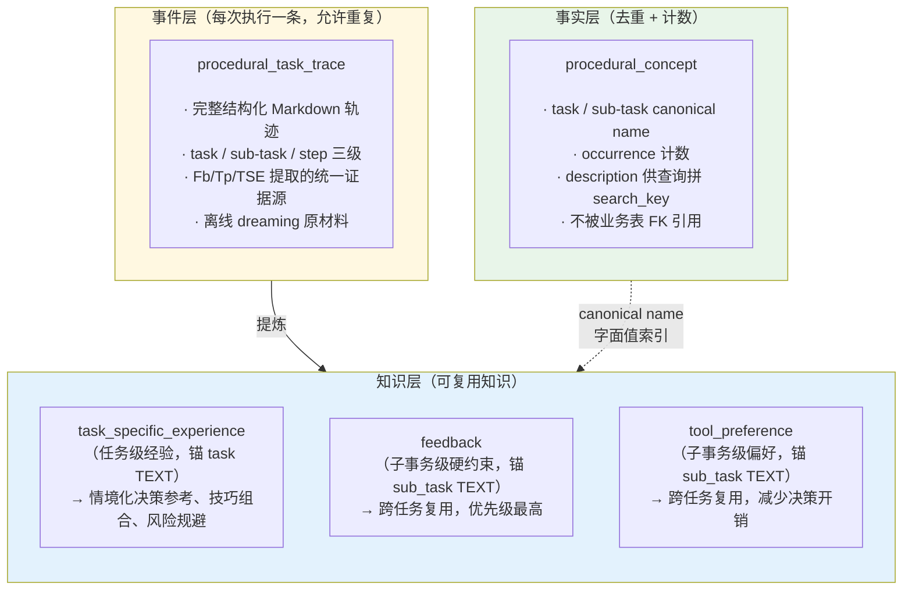

# V6 Learning — 整体架构图

> 基于 `design-v6-learning.md` §1 整体架构生成的可视化架构图

---

## 一、数据流总览（从下到上）

---

## 二、Chunk Flush 内部细节（Step 5 展开）

---

## 三、三层数据模型

---

## 四、核心参数速查

| 参数 | 值 | 说明 |
|------|----|------|
| 窗口大小 `n` | 8 轮 | 1 轮 = user + assistant 一对 |
| 重叠 `m` | 2 轮 | 相邻窗口重叠 |
| 步长 `step` | 6 轮 | n - m |
| 定时器周期 | 120s | InstanceWorker 扫描间隔 |
| Jaccard 阈值 | 0.6 | 主题边界快速门控 |
| chunk 上限 | 3 窗口 / 2h | 强制 flush 条件 |
| hybrid 查重 | 0.80·cos + 0.20·kw | 三档阈值：≥0.85 / 0.50-0.85 / <0.50 |
| 升格 delta | 3 | mention - last_promoted ≥ 3 |

---

## 五、读写边界总结

| 操作 | 读 | 写 |
|---|---|---|
| 在线 chunk flush | `procedural_candidates` + `procedural_concept` | `procedural_task_trace`、`procedural_concept`、`procedural_candidates` |
| 离线升格 worker | `procedural_candidates` | `mem_record` + 三个 meta 扩展表、回写 `procedural_candidates.last_promoted_*` |
| Agent 召回 | `mem_record` + 三个 meta 扩展表 | — |
